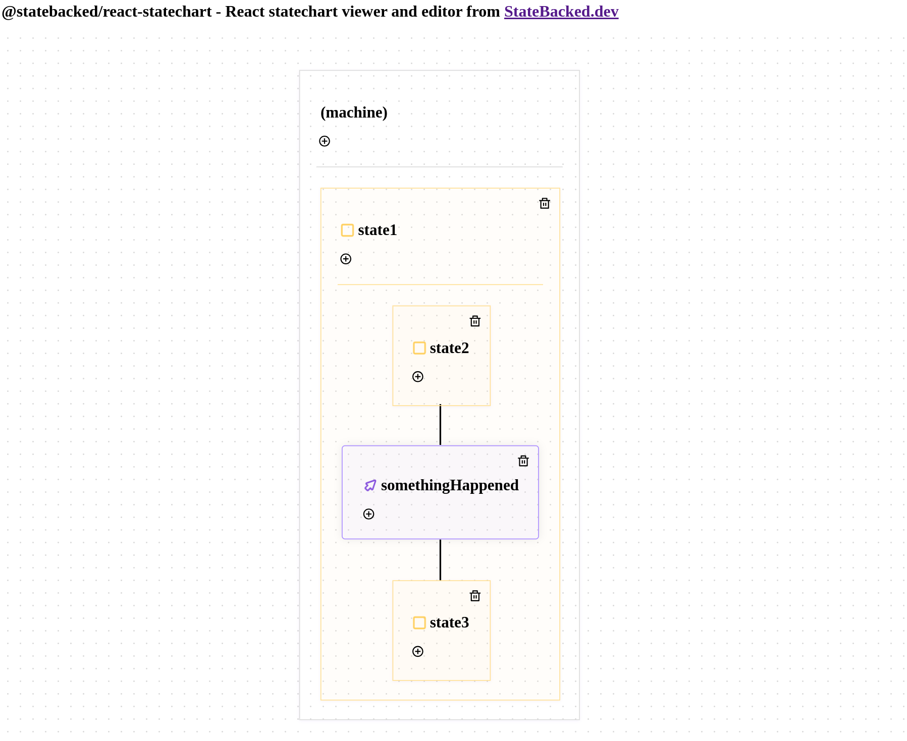

# @statebacked/react-statechart &middot; [](https://github.com/statebacked/react-statechart/blob/main/LICENSE) [](https://www.npmjs.com/package/@statebacked/react-statechart) [](https://github.com/statebacked/react-statechart/actions/workflows/ci.yaml)

React components for visualizing and editing statecharts (hierarchical state machines).

These components are in production use in [State Backed](https://app.statebacked.dev), the first platform for deploying state machine-based real-time backends and workflows, as well as [Team Pando](https://www.teampando.com), the collaborative way to define how your product works.

However, you should consider this initial public release to be beta quality software as we work towards genericizing and hardening the components and adding support for improved customizability.

PRs and issues are welcome!

# Example

Check out [the example app](https://github.com/statebacked/react-statechart/tree/main/app) for a complete code example.



# Installation

```bash
npm install --save @statebacked/react-statechart
```

# Usage

The primary exported component is `FlowGraph` and you will likely want to import or customize the bundled react-statechart.css.

`FlowGraph` expects a flow definition in a simplified representation that we define in the `schema` export.

To convert an XState machine definition into the @statebacked/react-statechart representation, you can use the provided conversion functions from the `xstate` export.

Here's some example code to render an XState statechart:

```javascript
import {
  FlowGraph,
  GridBackground,
  xstate,
} from "@statebacked/react-statechart";
import { createMachine } from "xstate";
import "@statebacked/react-statechart/index.css";

// any XState machine
const machine = createMachine({
  initial: "state1",
  states: {
    state1: {
      initial: "state2",
      states: {
        state2: {
          on: {
            somethingHappened: "state3",
          },
        },
        state3: {},
      },
    },
  },
});

// convert to @statebacked/react-statechart representation
const flow = xstate.machineToFlow(machine);

export const YourComponent = () => {
  return <FlowGraph flow={flow} />;
};
```

To support editing, pass an object with the necessary callbacks to the `editable` property.

# State Backed

This component is provided by [State Backed](https://app.statebacked.dev), the first backend-as-a-service centered around statecharts and state machines.
We're confident that statecharts are a crucial abstraction that can help us all build better software, faster.
So our goal is to make it as easy as possible for all engineers to experience the power of declarative logic.
Use this for anything you'd like! If possible, please tell us about what you build by opening a Github issue.
And if you'd like to experience the power and fun of a statechart-native backend, try out the [State Backed](https://app.statebacked.dev) free plan.

# License

@statebacked/react-statechart is [MIT licensed](https://github.com/statebacked/react-statechart/blob/main/LICENSE).
